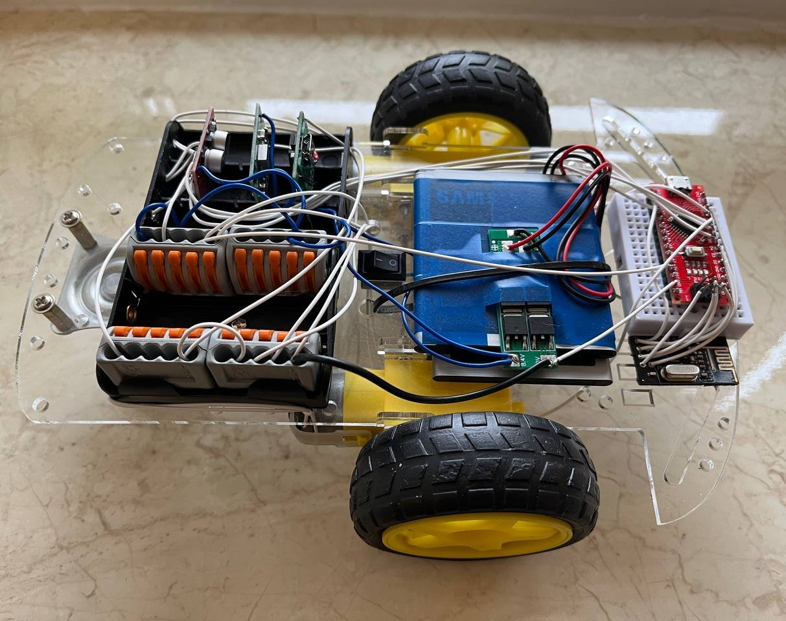
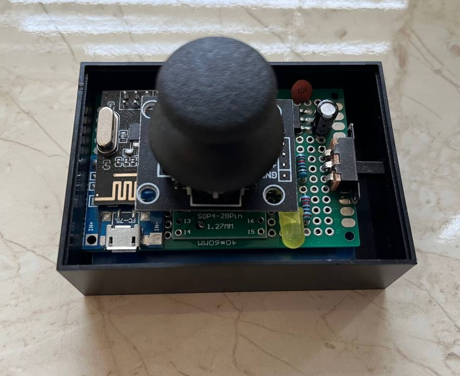
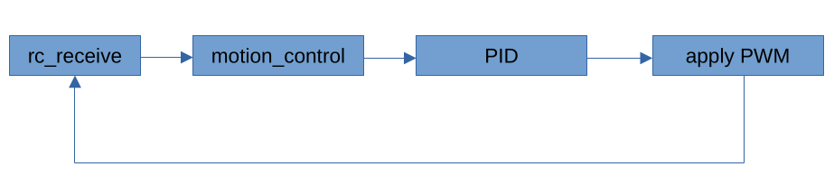

# Description

This project is a remote-controlled toy car powered by two **AVR** microcontrollers.
It uses an **nRF24L01** radio module for communication, dual H-bridge drivers for two motors, and closed-loop **PID** speed controller that uses readings from hall sensors.
Firmware is written in **C** using bare-metal register access and includes lightweight debug system.






# Hardware

### Toy car

- **MCU:** AVR ATmega168P;
- **Radio:** nRF24L01 2.4 GHz;
- **Motors:** 2x 8V brushed DC motors;
- **Motor driver:** L298N;
- **Power:** 2x 3.7V Li-ion batteries, BMS, USB charger, DC-DC converter;
- **Other:** 2x hall sensors, 2x analog switches;

### Remote control

- **MCU:** AVR ATtiny24A;
- **Radio:** nRF24L01 2.4 GHz;
- **Control:** joystick HW-504;
- **Power:** 3.7V Li-ion battery, USB charger, LDO;
- **Other:** LED, switch;


# Software

### Architecture

Almost all software is divided into two layers: driver and application. 

- **Driver.** Low level code related to register access, peripheral configuration, peripheral initialization.
- **Application.** Code, that's not related or not only related to register access. Software that built on top of the drivers, and corresponds to one specific use.

Some modules (such as simple PWM or timer modules) are too small to justify a strict driver/application separation. In these cases, the functionality is implemented in a single combined module to keep the code clean and avoid unnecessary fragmentation.

### Diagram



- **rc_receive.** The remote control unit (based on an ATtiny24) reads the joystick position through its ADC, normalizes both X and Y axes to the range 
  –255 … 255, and packages the values for transmission. The ATtiny24 sends the normalized input over SPI to the nRF24L01 module, which continuously transmits the control packets. Toy car receives the normalized input (x; y) and passes it to the motion control.
- **motion_control.** The motion control receives (x; y) input and calculates the vehicle's desired angle via arc tangent function (atan2). The motion control takes this angle as the target angle for the vehicle. The acceleration value is derived from the maximum magnitude of the joystick axes: max(abs(joys.x), abs(joys.y)). The greatest value of (x; y) is a throttle. Current RPM for both motors is provided by the hall sensor driver. The motion control calculates target RPM for both wheels using differential drive mixing formula:

```
  a_rpm_target = rpm_base * (cos(joys_angle_rad) + sin(joys_angle_rad));
```

```
  b_rpm_target = rpm_base * (cos(joys_angle_rad) - sin(joys_angle_rad));
```

- **PID.** PID controller calculates actuating signal for both motors using proportional-integral-derivative parts, the error between target and current RPM, and stable predetermined P, I, D coefficients. Controller sums P, I, D, clamps result, and motion control transfers the result to the motor driver.
- **apply PWM.** The motor driver assigns PWM to a certain PWM channel that corresponds to a certain motor channel. Loop repeats.
